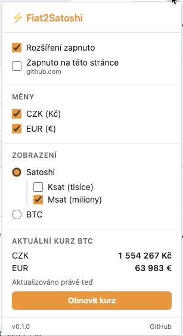

# Fiat2Satoshi

Browser extension (Chrome / Brave, Manifest V3), která automaticky detekuje ceny ve fiat měnách (CZK, EUR) na webových stránkách a nahrazuje je ekvivalentem v satoshi podle aktuálního BTC kurzu.



## Co extension dělá

Na libovolné webové stránce najde ceny v CZK a EUR a nahradí je ekvivalentem v satoshi podle aktuálního BTC kurzu z CoinGecka. Podporované formáty (ukázka):

```
1 234 Kč
1234,50 Kč
1 234,- Kč
CZK 1 234
€ 99,90
1 234,50 €
EUR 1234
```

- Přepočítá je na satoshi podle aktuálního BTC kurzu (obnovováno každých 5 minut)
- Ukáže výslednou hodnotu jako `⚡ N sats` (či Ksat/Msat/BTC dle nastavení)
- Při hoveru nad převedenou hodnotou zobrazí tooltip s původní cenou, použitým kurzem a časem aktualizace

## Instalace

### Z Chrome Web Store

_(zatím nepublikováno — odkaz bude doplněn)_

### Developer mode (pro přispěvatele)

1. Naklonuj repozitář:
   ```bash
   git clone https://github.com/bitcoinvkapse/fiat2satoshi.git
   cd fiat2satoshi
   ```
2. V Chrome / Brave otevři `chrome://extensions/`
3. Zapni **Developer mode** (pravý horní roh)
4. Klikni na **Load unpacked** a vyber složku `fiat2satoshi/`
5. Extension se objeví v liště (ikona ⚡)

## Konfigurace

Klikni na ikonu extension pro:
- Zapnutí / vypnutí celé extension
- Zapnutí / vypnutí jednotlivých měn (CZK, EUR)
- Zobrazení aktuálního kurzu
- Ruční obnovení kurzu

Nastavení se synchronizuje přes `chrome.storage.sync` napříč zařízeními.

## Jak přidat novou měnu

1. Vytvoř soubor `content/currencies/<code>.js` podle vzoru `czk.js`:
   ```js
   (function (global) {
     'use strict';

     function parseMyNumber(raw) { /* … */ }

     const SUFFIX_RE = /…/gu;
     const PREFIX_RE = /…/gu;

     const MYC = {
       code: 'XYZ',
       enabled: true,
       patterns: [
         { regex: SUFFIX_RE, extract: (m) => parseMyNumber(m[1]) },
         { regex: PREFIX_RE, extract: (m) => parseMyNumber(m[1]) }
       ],
       parse: parseMyNumber
     };

     const F2S = (global.__F2S = global.__F2S || { currencies: [] });
     F2S.currencies.push(MYC);

     if (typeof module !== 'undefined' && module.exports) {
       module.exports = { MYC, parseMyNumber };
     }
   })(typeof globalThis !== 'undefined' ? globalThis : this);
   ```
2. Přidej soubor do `manifest.json` → `content_scripts[0].js` (před `content/currencies/index.js`).
3. Přidej kód měny do volání CoinGecka v `background/service-worker.js` (parametr `vs_currencies`) a do mapy `rates`.
4. Přidej toggle do `popup/popup.html` a handler do `popup/popup.js`.
5. Napiš testy v `test/<code>-parser.test.js`.

## Site adaptéry

Většinu webů zvládne generický parser nad textovými uzly. Některé e-shopy ale cenu rozkládají přes víc spanů (celé číslo v jednom, desetinné v `<sup>` / `<sub>`, symbol měny jako samostatný element), takže jediný text node cenu neobsahuje — tam pomohou site adaptéry v `content/adapters/`:

- **rohlik.cz** (+ další domény skupiny Rohlik) — listing, detail produktu, košík. Kotví se na `data-test="*-priceNo"` / `*-currency`, pro košík fallback na textContent kontejneru.
- **allegro.cz** (+ .pl/.sk/.hu/.it) — heuristika nad fragmentovanými text nody (Allegro používá hashované CSS třídy, žádné stabilní markery).

Adaptér se aktivuje jen na své doméně (`hostMatches`). Přidání nového adaptéru = nový soubor v `content/adapters/` s funkcemi `hostMatches(hostname)` a `findContainers(root)`, registrace v `manifest.json` (`content_scripts[0].js`). Vzor viz [`content/adapters/rohlik.js`](content/adapters/rohlik.js).

## Testy

```bash
node --test test/
```

Více viz [`test/README-test.md`](test/README-test.md). Potřebuješ Node.js 18+ (nic dalšího).

## Známá omezení

- **Falešná pozitiva:** parser může občas zachytit čísla, která nejsou ceny (např. fakturační kód následovaný zkratkou CZK). Heuristika je laděná pro nejčastější případy, ale není neomylná.
- **SPA stránky:** stránky, které dynamicky přepisují DOM (React/Vue apps), jsou podchyceny pomocí `MutationObserveru` + deferred re-scanu, ale velmi rychlé přerenderování může v ojedinělých případech způsobit chvilkový záblesk původní ceny.
- **Vnořené elementy:** cena rozdělená do více textových uzlů (typicky částka a symbol měny v samostatných `span`ech) se obecně nepodchytí — generický parser pracuje v rámci jednoho textového uzlu. Pro vybrané weby to řeší [site adaptéry](#site-adaptéry).
- **Přesnost kurzu:** kurz se obnovuje každých 5 minut, v krátkodobých výkyvech BTC může konverze zaostávat. Při nedostupnosti CoinGecka zůstanou ceny beze změny a chyba se zobrazí v popupu.

## Technické detaily

- **Manifest V3**, vanilla JS, žádný build step, žádné závislosti.
- **Permissions:** `storage`, `alarms`, `activeTab`.
- **Host permissions:** `https://api.coingecko.com/*`.
- **Žádné `innerHTML` zápisy** — pouze DOM API (bez XSS rizika).
- Zpracované hodnoty mají CSS třídu `.sats-value` a drží original v `data-original` atributu.

## Vývoj

Struktura repozitáře viz [fiat2satoshi-zadani.md](fiat2satoshi-zadani.md).

Před prvním commitem spusť `./setup-git.sh` (nejdřív nahraď `bitcoinvkapse`).

## License

[MIT](LICENSE) © 2026 Tomas Krause
